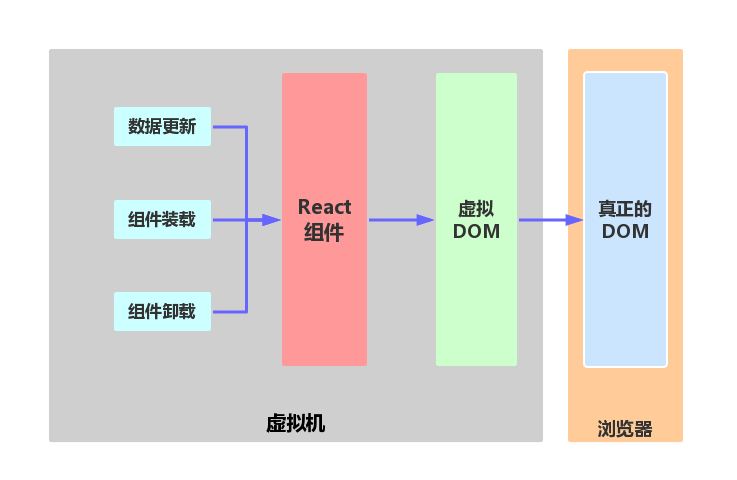

# React 初探

> 官网：https://facebook.github.io/react/

> 中文官网：http://reactjs.cn/react/index.html

> github：https://github.com/facebook/react

`仅仅是UI` `虚拟DOM` `数据流`

## React开发环境搭建

> * Nodejs、npm
> * 使用npm安装react、react-dom、react-tools

## 从一个小Demo说起

项目代码：//TODO

*index.ejs:*

	<!DOCTYPE html>
	<html>
		<head>
		  <meta charset="utf-8" />
		  <title>React Tutorial</title>
		
		</head>
		<body>
			

			
			
		</body>
	</html>

*demo.js:*

	var CommentBox = React.createClass({//创建一个React组件
	    render : function(){
	        return (
	            
Hello,World! I am a demo
	                <h1 value="dd">ss </h1>
	            

	        );
	    }
	});
	
	//实例化根组件，启动框架，把标记注入到第二个参数指定的原生DOM元素中。
	React.render(
	    <CommentBox />,
	    document.getElementById("content")
	);

&emsp;&emsp;React.render()和ReactDOM.render()?

### JSX
  先看如下代码：
  	
	<html>
	    <head>
	      
	      
	    </head>
	    <body>
	      

	      
	    </body>
  	</html>

&emsp;&emsp;上面的代码在js中插入了html代码，这就叫JSX。为了使js中的html代码可以生效，需要使用 `JSXTransformer.js` 文件来讲jsx中的xml转换为js代码，并且将jsx代码的type类型声明为 `text/js` 
&emsp;&emsp;经过JSXTransformer.js转换后的代码如下：

	<html>
	    <head>
	      
	      
	    </head>
	    <body>
	      

	      
	    </body>
  	</html>

> 官方：请注意，某些浏览器（如，Chrome浏览器）将无法加载该文件，除非它通过HTTP服务。

&emsp;&emsp;so，为何要使用JSX？使用JSX是为了方便开发期间的代码编写，代码看起来更简单易懂，方便维护。但是，React官方的建议是不要在生产环境里使用JSX，因为有些浏览器是无法解释JSX的。**正确的做法是：在开发期间使用JSX，在产品发布打包的时候使用JSX转换工具将JSX代码转换成真正的js代码，并且，JSX转换工具可以很轻松的集成到大部分的打包系统里。**

&emsp;&emsp;JSX并不是强制使用的，只是为了开发环境中方便编码及配合设计师工作。如果在开发环境中，也可以不使用JSX,React为绝大部分HTML标签提供了内置工厂方法，比如：

	var root = React.DOM.ul({ className: 'my-list' },
             React.DOM.li(null, 'Text Content')
           );

#### 如何将JSX转换成js

&emsp;&emsp;使用react-tools将JSX转换成js，具体的使用步骤如下：
	
* npm install -g react-tools **全局安装** react-tools包。
* 命令行使用jsx --watch 源目录 目标目录  *--watch参数为自动检测源目录的文件修改*

&emsp;&emsp;其中源目录是React的js代码文件，目标目录是经过转换后的js文件。执行上述命令后，每当修改源目录下的js文件的时候都会自动更新目标目录中js文件。
&emsp;&emsp;所以在产品发布的时候，不应该使用JSXTransformer.js。而应该使用react-tools将JSX转换成js。

## 知识点
	
* createClass()方法
* JSX
* 组件属性
	* **props** 只读，不建议修改
	* **state** 可写可读，可以修改（setState方法），触发页面渲染
	* **refs** 冲出虚拟DOM的限制，通过getDOMNode()方法获得真正的DOM元素实例
* 组件方法
	* **getInitialStete()**初始化状态、数据
	* **componetDidMount()**方法，第一次被渲染时候调用
	* **setState()**方法，
		* 该方法可能不会立刻把this.state的值改变，而是创建一个即将处理的state转变。也就是是说在调用该方法后再去获取this.state的值，可能得到的还是现有的值，而不是新设置的值。
		* 这个方法不保证同步性，React为了提升渲染性能，可能会批量的执行state转变和DOM渲染
		* 每执行一个setState()方法，都会触发一次重绘，除非在shouldComponentUpdate()中实现了条件渲染逻辑。默认shouldComponentUpdate()方法返回true。
* 组件的生命周期（will、did）
	* 挂载
		* **getInitialState()**:在组件被挂载之前调用。状态化得组件应该实现这个方法，返回初始的state数据。
		* **componentWillMount()**:在挂载发生之前立即被调用
		* **componentDidMount()**:在挂载结束之后马上被调用。需要DOM节点的初始化操作应该放在这里。
	* 更新
		* **componentWillReceiveProps(object nextProps)**：当一个挂载的组件接收到新的props的时候被调用。该方法应该用于比较this.props和nextProps，然后使用this.setState()来改变state。
		* **shouldComponentUpdate(object nextProps, object nextState)**: boolean当组件做出是否要更新DOM的决定的时候被调用。实现该函数，优化this.props和nextProps，以及this.state和nextState的比较，如果不需要React更新DOM，则返回false。
		* **componentWillUpdate(object nextProps, object nextState)**：在更新发生之前被调用。你可以在这里调用this.setState()
		* **componentDidUpdate(object prevProps, object prevState)**：在更新发生之后调用
	* 移除
		* **componentWillUnmount()**：在组件移除和销毁之前被调用。清理工作应该放在这里
* Tips：
	* 需要注意react.js和react-dom.js的版本问题，尽量保证这两个版本一致
	
## 使用React构建Web应用

### 从页面原型开始

* 拆分用户界面为一个组件树
	* 每个组件对应一段json数据结构（用户界面与数据模型的一致性）
	* 单一职责
* 使用React构建静态页面
* 静态页面——>可交互页面
	* 确定state数据
	* 确定state声明周期
	* 数据流（单向数据绑定、反向流动）

## 为什么用React

* **组件 VS 模板**
	* 代码分离解耦
	* 组件复用
* **简单**：需要做的就是用React表达出在任意时间点程序应该长得样子，然后更新数据。至于数据的显示刷新完全由React自动完成。
* **渲染效率高**
	* 虚拟DOM，增量化渲染

> **虚拟DOM**

> React在内存中维护了一个快速响应的DOM描述。render()返回一个DOM的描述，React能够利用内存zhong的描述来快速的计算出差异，然后更新浏览器中的DOM。
